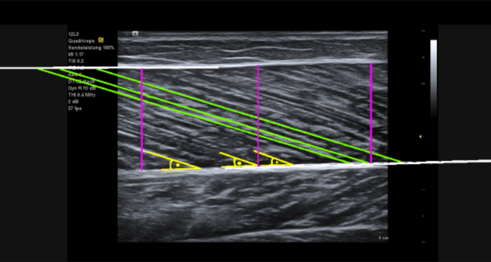

# UMUDチャレンジ：超音波データによる筋肉構造の解析

[公式：umud-challenge-muscle-architecture-in-ultrasound-data](https://www.kaggle.com/competitions/umud-challenge-muscle-architecture-in-ultrasound-data)

# 課題概要

このコンテストの目的は、超音波画像から3つの主要な筋肉構造変数を正確に推定できるアルゴリズムを構築することです。


テストデータセット内の各超音波画像について、これら3つの値を予測する必要があります。
[提出されたデータは、 UMUDスコアという](https://www.kaggle.com/code/paulritsche/umud-score)複合指標を用いてランク付けされます。この指標は、3つの変数すべてにおける予測精度を評価するものです。


# リポジトリ内の主なファイル、ノートブック

| 名称      | ファイル名  | 備考     |
| ---------- | ---- | ------ |
|データの確認 | [study.ipynb](https://github.com/kenkenkengo0421/Muscle_Architecture_in_Ultrasound_Data/blob/main/study.ipynb) | |
|apo_fascセグメンテーション|[segmentation.ipynb](https://github.com/kenkenkengo0421/Muscle_Architecture_in_Ultrasound_Data/blob/main/segmentation.ipynb)||
|モデルベースライン(.pth)|[UMUD Challenge dataset](https://www.kaggle.com/datasets/nagatakengo/segmentation-baseline-models)||
|予測と提出|[submission_of_predict.ipynb](https://github.com/kenkenkengo0421/Muscle_Architecture_in_Ultrasound_Data/blob/main/submission_of_predict.ipynb)||
|モデル作成時のログ|[memo.txt](https://github.com/kenkenkengo0421/Muscle_Architecture_in_Ultrasound_Data/blob/main/memo.txt)||


# 評価指標

提出された提案は、3つのアーキテクチャ変数すべてにおける予測誤差を測定するUMUDスコアを使用して評価されます。

このスコアは、以下の項目における
正規化された平均絶対誤差（MAE)に基づいています。




```
羽状角(Pennation Angle)（PA）：筋束と腱膜の間の角度（度）黄色
    
筋束長(Fascicle Length)（FL）：筋束の長さ（ミリメートル）（緑色）
    
筋厚(Muscle Thickness)（MT）：表層腱膜と深層腱膜間の距離（ミリメートル）（ピンク色）
```


各変数の誤差は、異なる単位や尺度であっても比較可能な影響を確保するために、あらかじめ定義された許容値によって正規化されます。スコア**が低いほど、パフォーマンスが優れていることを示します。**


# ローカルでの指標（この指標をもとに改善）

## 主指標：Validation Dice

予測maskと正解maskの一致度を評価する。

```math
\mathrm{Dice}
=
\frac{2TP}
{2TP + FP + FN}
```

- `TP`：正解maskが1で、予測maskも1だった画素
- `FP`：正解maskは0だが、予測maskを1とした画素
- `FN`：正解maskは1だが、予測maskを0とした画素
- apo / fasc それぞれで確認する
- 大きいほど良い
- モデル保存時の主な判断基準とする


## 副指標：Validation Loss

学習時の予測誤差を確認する。


```math
\mathrm{Loss}
=
\mathrm{BCEWithLogitsLoss}
+
\mathrm{DiceLoss}
```


### BCEWithLogitsLoss


```math
\mathrm{BCE}
=
-\left[
w \, y \log(p)
+
(1-y)\log(1-p)
\right]
```

- `y`：正解maskの値（0 または 1）
- `p`：モデルが予測した確率
- `w`：正例に対する重み（pos_weight）
- apo：pos_weight = 1.5
- fasc：pos_weight = 15

### DiceLoss

```math
\mathrm{DiceLoss}
=
1
-
\frac{2\sum (p \cdot y)}
{\sum p + \sum y}
```

- 小さいほど良い
- 学習状態の確認用として使用する
- Validation Diceと合わせて確認する


## 最終評価：Kaggle Public Score

モデル完成後、submissionを作成してKaggle上で確認する。

```math
\mathrm{Score}
=
\frac{1}{3}
\left(
\frac{\mathrm{MAE}_{PA}}{6}
+
\frac{\mathrm{MAE}_{FL}}{12}
+
\frac{\mathrm{MAE}_{MT}}{3}
\right)
```

- PA の許容値：6 deg
- FL の許容値：12 mm
- MT の許容値：3 mm
- 小さいほど良い
- ローカルでは正解 PA / FL / MT が存在しないため、直接計算しない


# 環境

* linux

```
git clone https://github.com/kenkenkengo0421/Muscle_Architecture_in_Ultrasound_Data.git
```

```
python3 -m venv .venv
```

```
source .venv/bin/activate
```
#deactivate

```
pip install -r requirements.txt
```
#pip freeze > requirements.txt

```
jupyter lab
```


